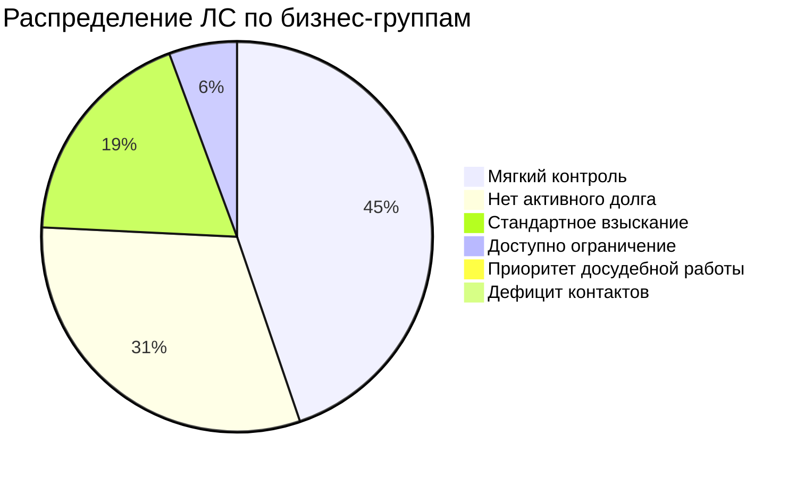
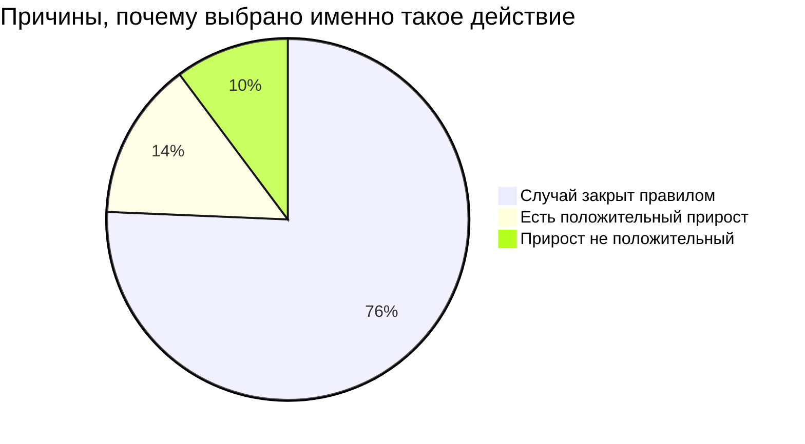
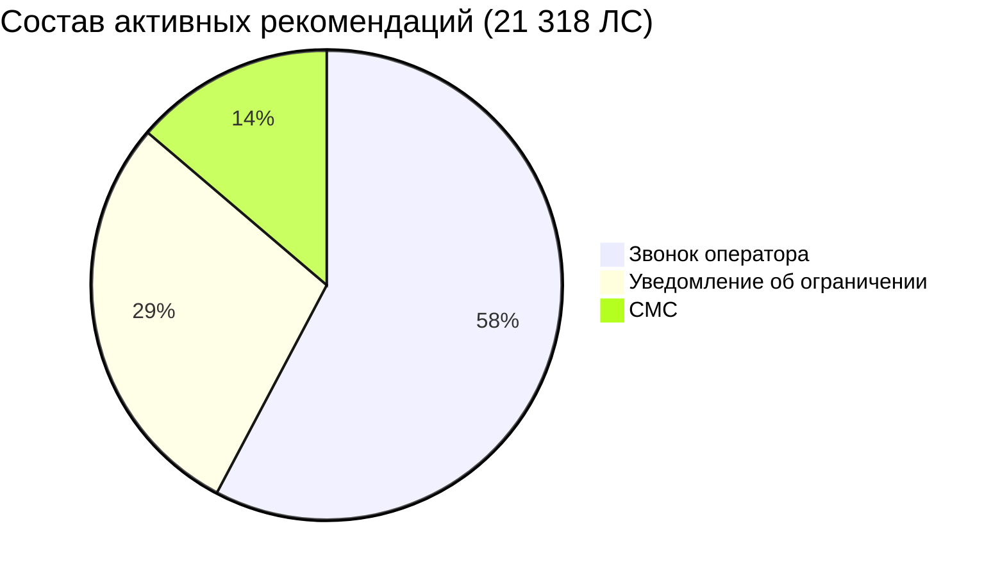

# Презентация по проекту: персональные меры взыскания

Ниже готовый текст для слайдов на основе фактического кода и текущих выходных таблиц проекта.

---

## Слайд 1. Заголовок
**Интеллектуальный подбор мер взыскания для энергосбыта**

Подзаголовок:
- Период расчета: март 2026
- Формат: локальное решение, единая точка входа `main.py`

Короткая подпись:
- Проект переводит работу с долгом от общих правил к персональному плану по каждому лицевому счету.

---

## Слайд 2. Проблема и цель
**Проблема бизнеса**
- Компания платит поставщикам энергии в срок, а часть клиентов платит позже.
- Из-за этого появляются кассовые разрывы и лишняя кредитная нагрузка.
- Ресурсы мер ограничены, значит нельзя применять их одинаково ко всем.

**Цель проекта**
- Для каждого лицевого счета выбрать разумную меру на ближайший месяц.
- Учитывать поведение клиента, историю оплат и историю прошлых воздействий.
- Давать понятное объяснение решения.

---

## Слайд 3. Что реализовано в коде
**Единый конвейер обработки**
- Последовательно выполняются 7 этапов: от чтения файлов до рекомендаций.
- Основной запуск: `main.py`.
- Настройки собраны в одном месте (`pipeline/settings.py`).

**Интерфейс загрузки данных**
- В панели есть форма загрузки стандартных выгрузок.
- Обязательные файлы для нового расчета: `02` (баланс) и `03` (оплаты).
- Каждый запуск пишется отдельно в `output/runs/<run_id>`, результаты не перетираются.

---

## Слайд 4. Данные и качество
**Объем текущего расчета**
- Сырых строк обработано: **2 220 712**
- Лицевых счетов в профиле: **150 787**
- Строк в месячной витрине: **2 261 805**

**Контроль качества данных**
- Найдено проблемных записей: **5 859** (это **0,264%** от сырого слоя).
- Главный тип проблемы: нечисловой номер лицевого счета.
- Процесс не останавливается: ошибки выносятся в отдельную таблицу `dq_issues.csv`.

Текстовый график качества:
- Корректные строки: `█████████████████████████████████████████████████` 99,736%
- Проблемные строки: `▏` 0,264%

---

## Слайд 5. Как проходит обработка данных
**Путь данных от входа к решению**

Подпись к слайду:
- Логика построена так, чтобы на этапе рекомендации использовать только данные, которые были известны на момент решения.

---

## Слайд 6. Сегментация клиентов
**Как устроена сегментация**
- Сначала применяются бизнес-шлюзы: закрытые случаи, мягкий контроль, стандартное взыскание и приоритетные группы.
- Внутри доступных групп применяется метод K-средних по 12 признакам.
- В текущем расчете: 6 бизнес-групп и 16 подгрупп.

Распределение по бизнес-группам:

Главный вывод:
- Для **114 095** ЛС система сразу оставляет правило без модели.
- Для **36 692** ЛС доступен модельный выбор.

---

## Слайд 7. Как выбирается мера воздействия
**Логика выбора**
- Рассматриваются 3 меры: СМС, звонок оператора, уведомление об ограничении.
- Для каждой меры строится отдельный расчет вероятности оплаты.
- Рекомендация дается только если:
- случай разрешен для модельного выбора;
- прирост вероятности оплаты положительный.

**Почему такой выбор**
- На старте проекта это самый надежный и быстрый путь получить работающий результат.
- В коде уже подготовлена база для расширения на полный список мер.

---

## Слайд 8. Итоги текущего расчета
**Итог по 150 787 лицевым счетам**
- Активная мера назначена: **21 318** (14,14%).
- Без активной меры: **129 469** (85,86%).
- Ожидаемый суммарный прирост оплат: **4 253,8** условных оплат в горизонте месяца.

Причины решения:

---

## Слайд 9. Какие меры выбираются, когда действие назначено
**Распределение среди активных мер**

Короткий вывод:
- Чаще всего система выбирает звонок оператора.
- Это согласуется с тем, что в текущих данных эта мера чаще дает лучший точечный эффект в разрешенных группах.

---

## Слайд 10. Пример понятного объяснения решения
**Пример профиля: `gate_standard_collect_c0`**
- Размер группы: **17 300** ЛС.
- Активная мера назначена: **7 946** ЛС.
- Без активной меры: **9 354** ЛС (нет положительного прироста).

**Как звучит объяснение для бизнеса**
- Клиент в группе стандартного взыскания.
- Если расчет показывает положительный прирост, назначаем меру.
- Если прирост не положительный, не тратим ресурс на действие, которое с высокой вероятностью не даст пользы.

---

## Слайд 11. Проверяемость и надежность
**Что подтверждает надежность решения**
- Есть набор автоматических тестов по ключевым узлам конвейера.
- Проверяется чтение и очистка данных, защита от утечки будущей информации, сегментация и расчет рекомендаций.
- Текущий прогон тестов: **22 теста, все успешны**.

**Время полного расчета на текущем наборе**
- Общая длительность: **908,9 сек** (около 15 минут).
- Самые тяжелые этапы: витрина признаков и расчет эффекта мер.

---

## Слайд 12. Честный аудит: что уже хорошо и что нужно усилить
**Сильные стороны**
- Единая и понятная структура конвейера.
- Хороший объем данных и прозрачный контроль качества.
- Есть объяснимое правило: когда назначать меру, а когда не назначать.
- Есть рабочий интерфейс загрузки данных и получения результата.

**Что важно до промышленного запуска**
- Сейчас расчет рекомендаций использует только 3 меры из полного списка.
- Лимиты из файла `14` уже читаются, но в выборе меры пока не участвуют как жесткий оптимизатор.
- Полная каскадная логика процедур в рекомендации реализована частично, ее нужно довести до строгого соблюдения на уровне выбора мер.

---

## Слайд 13. Финальный вывод
**Что мы получили**
- Решение, которое уже сейчас дает персональные рекомендации по каждому лицевому счету.
- Переход от одинаковых действий ко всем к осознанному выбору по данным.
- Прозрачный результат: что делать, кому делать и почему именно так.

**Следующий практический шаг**
- Пилот на части портфеля с замером эффекта по оплатам и затратам на меры.

---

# Текст выступления (7 минут, послайдово)

## Слайд 1 — 0:00-0:25
«Мы сделали систему, которая помогает выбирать меры взыскания по каждому лицевому счету не по шаблону, а по данным. Решение работает локально, запускается из `main.py`, и сегодня я покажу, как именно оно принимает решения».

## Слайд 2 — 0:25-1:00
«Проблема понятная: платить поставщикам нужно вовремя, а часть клиентов платит с задержкой. Из-за этого возникают кассовые разрывы. Если применять меры одинаково ко всем, мы тратим ресурс не туда. Поэтому цель проекта — выбрать для каждого клиента разумное действие на ближайший месяц и объяснить этот выбор».

## Слайд 3 — 1:00-1:30
«В коде мы собрали единый конвейер из семи этапов: от чтения файлов до финальной рекомендации. Плюс сделали интерфейс загрузки данных: обязательны только баланс и оплаты, остальное можно добавлять по ситуации. Каждый запуск сохраняется отдельно, поэтому результаты не теряются и не смешиваются».

## Слайд 4 — 1:30-2:10
«По текущему расчету мы обработали более двух миллионов строк, получили 150 тысяч лицевых счетов и более двух миллионов строк витрины признаков. Очень важно, что у нас встроен контроль качества данных: найденные проблемы не ломают процесс, а фиксируются отдельно. Доля таких строк маленькая — около четверти процента».

## Слайд 5 — 2:10-2:45
«Здесь путь данных. Сначала сырые выгрузки, затем нормализация и контроль качества, потом построение признаков по месяцам. После этого сегментация, расчет ожидаемого прироста оплаты и итоговая рекомендация. Такой порядок защищает от ошибок и делает расчет повторяемым».

## Слайд 6 — 2:45-3:30
«Сегментация двухуровневая. Сначала жесткие бизнес-группы: где долг закрыт, где мягкий контроль, где стандартное взыскание и так далее. Затем внутри разрешенных групп идет дополнительное деление методом K-средних. Это дает баланс: бизнес-правила соблюдаются, а модель работает там, где она действительно полезна».

## Слайд 7 — 3:30-4:15
«Дальше выбираем меру. Сейчас в модели три действия: СМС, звонок оператора, уведомление об ограничении. Для каждой меры отдельно оцениваем, повышает ли она вероятность оплаты. Назначаем только тогда, когда есть положительный прирост, иначе не расходуем ресурс. Это осознанная логика, а не автоматическое “назначить всем”».

## Слайд 8 — 4:15-5:00
«Итог по текущему запуску: активная мера назначена примерно 14% клиентов, по остальным решение — без активного действия. Это не слабость, а контроль качества воздействия. Суммарный ожидаемый прирост по портфелю — 4 253,8 условных оплат за месяц. Большая часть отказов связана с тем, что случай закрыт бизнес-правилом или не видно положительного эффекта».

## Слайд 9 — 5:00-5:35
«Если смотреть только активные рекомендации, чаще всего выбирается звонок оператора, затем уведомление об ограничении и СМС. Это отражает структуру текущих данных и профилей клиентов: система выбирает не самую “удобную” меру, а ту, где выше ожидаемый результат».

## Слайд 10 — 5:35-6:20
«Пример объяснения на группе `gate_standard_collect_c0`. В этой группе часть клиентов получает действие, часть — нет. Почему нет? Потому что расчет показывает неположительный прирост. Это важный момент: мы не просто “делаем меньше действий”, мы не делаем действий без ожидаемой пользы и этим экономим ресурс».

## Слайд 11 — 6:20-6:45
«Про надежность. Есть автоматические тесты на ключевые части: очистка данных, защита от утечки будущих данных, сегментация, рекомендации. Все 22 теста проходят. Полный расчет на текущем объеме занимает около 15 минут, это приемлемо для ежемесячного цикла».

## Слайд 12 — 6:45-6:55
«Честно о состоянии проекта: фундамент уже хороший, но до промышленного контура нужно расширить список мер, включить строгий учет лимитов в оптимизатор и довести каскадные ограничения до полного автоматического соблюдения».

## Слайд 13 — 6:55-7:00
«Итог: мы уже получили рабочую систему персональных рекомендаций, которая прозрачна для бизнеса. Следующий шаг — пилот на части портфеля с замером реального эффекта по оплатам и затратам».

